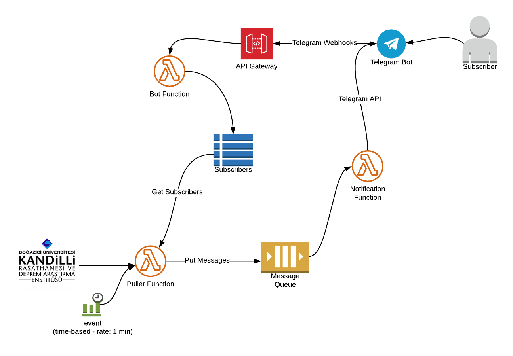

# AWS Lambda - Kandilli Earthquake Notifier

This project pulls the latest earthquakes from [Kandilli's website](http://www.koeri.boun.edu.tr) and pushes to a dedicated [Telegram channel](https://t.me/kandillisondepremler) and subscribers via Telegram Bot.

## Motivation

- People can follow earthquakes without extra application.
- In the case of communication network problems, the latest earthquake in Istanbul proved that instant messaging channels can remain alive and in operation.
- Reduce traffic on Kandilli's website
- Enhance data with other technologies such as Machine Learning, Geospatial, etc. 

## Diagram

## Technology Stack
- .Net 6 - C#
- [AWS Lambda](https://aws.amazon.com/lambda/)
- [AWS SQS](https://aws.amazon.com/sqs/)
- [AWS DynamoDB](https://aws.amazon.com/dynamodb/)
- [Telegram API](https://core.telegram.org/)

## How to Contribute

You can contrubute in various ways;

-  Coding - Creating a pull request for missing features
-  Creating an issue on Issues page for new ideas
-  Help for documentation
-  Promote the project's website or [Telegram channel](https://t.me/kandillisondepremler) to your friend to reach more people

## How to Support

You can support via [buying coffe to developer](https://www.buymeacoffee.com/mete)